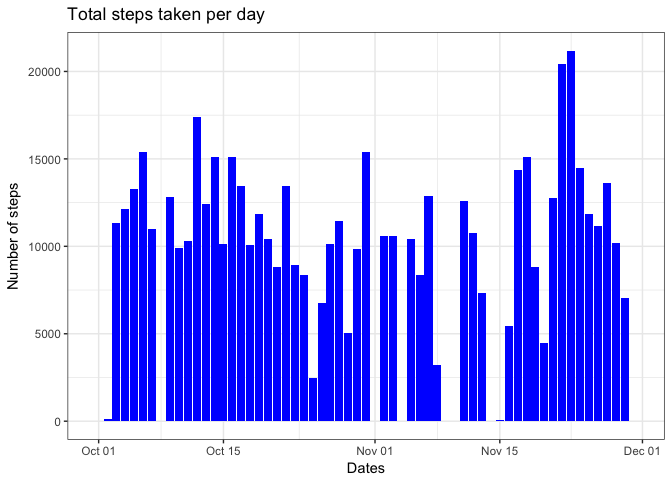
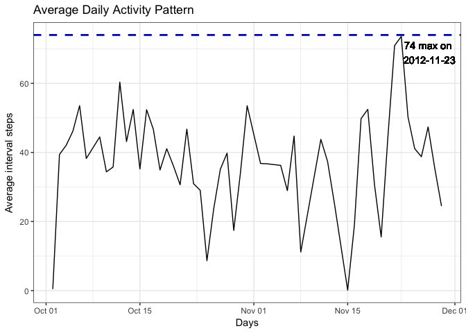
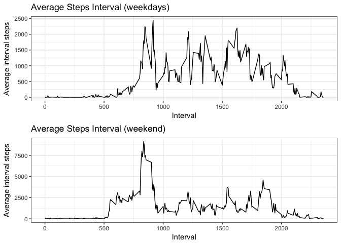

<style type="text/css">
table.table-data {
   max-width: 95%;
   border: 1px solid #ccc;
}

table.table-data th {
  text-align: left;
}

table.table-data td
{
   text-align:right;        
   width: 20%;
   text-align: left;
}
</style>

## Loading and preprocessing the data

Let's clean the data a bit. A `time` column will be created out of the `date` and `interval` 
columns with a `Date` type. 


```r
# Commented installations as this is long; uncomment to install!
#install.packages('reticulate') 
#install.packages('tidyverse') 
#install.packages('xtable')

require(dplyr)
```

```
## Loading required package: dplyr
```

```
## 
## Attaching package: 'dplyr'
```

```
## The following objects are masked from 'package:stats':
## 
##     filter, lag
```

```
## The following objects are masked from 'package:base':
## 
##     intersect, setdiff, setequal, union
```

```r
require(gridExtra)
```

```
## Loading required package: gridExtra
```

```
## 
## Attaching package: 'gridExtra'
```

```
## The following object is masked from 'package:dplyr':
## 
##     combine
```

```r
require(lubridate)
```

```
## Loading required package: lubridate
```

```
## 
## Attaching package: 'lubridate'
```

```
## The following object is masked from 'package:base':
## 
##     date
```

```r
require(ggplot2)
```

```
## Loading required package: ggplot2
```

```
## Warning: package 'ggplot2' was built under R version 3.3.2
```

```r
require(reticulate)
```

```
## Loading required package: reticulate
```

```
## Warning: package 'reticulate' was built under R version 3.3.2
```

```r
require(scales)
```

```
## Loading required package: scales
```

```
## Warning: package 'scales' was built under R version 3.3.2
```

```r
require(xtable)
```

```
## Loading required package: xtable
```

```r
# Read file and create a time field with proper lubridate/date class. 
activities <- read.csv('./activity.csv')
activities <- transform(activities, interval_pad = sprintf('%04d', activities$interval))
activities <- transform(activities, interval_fmt = gsub('^([0-9]{2})([0-9]{2})$', '\\1:\\2', activities$interval_pad))
activities <- transform(activities, date = ymd(as.character(activities$date)))
```

```
## Warning in as.POSIXlt.POSIXct(x, tz): unknown timezone 'zone/tz/2018e.1.0/
## zoneinfo/America/Montreal'
```

```r
activities <- transform(activities, time = ymd_hm(paste(as.character(activities$date), activities$interval_fmt)))

# Replace NA values for steps  with 0s.
activities <- transform(activities, steps_fz = ifelse(is.na(activities$steps), 0, activities$steps))

# Drop unnecessary & temporary columns.
activities <- activities[c('steps', 'steps_fz', 'date', 'interval', 'time')]
```

## What is mean total number of steps taken per day?

The exercise notes ask us to do an histogram but for the *taken steps per day* graph, it's 
just so much easier and beautiful to use a ggplot bar plot, preceded with a grouping operation 
applied on days. 


```r
act_agg <- activities %>%
  group_by(date) %>%
  summarise(
    total_steps = sum(steps_fz),
    mean_steps = mean(steps_fz),
    median_steps = median(steps_fz)
  )

steps_table <- xtable(act_agg)
digits(steps_table) <- c(0,0,0,2,2)
steps_table$date <- as.character(steps_table$date)
```

#### Calculate the total number of steps taken per day

Display the number of steps per day in a table along with its mean and media of each interval:


```r
print(steps_table, type='html',  caption="Number of Steps per Day",
  caption.placement='top',
  html.table.attributes="class='table-data'", 
  include.rownames=FALSE)
```

<!-- html table generated in R 3.3.0 by xtable 1.8-3 package -->
<!-- Tue Oct  9 00:40:43 2018 -->
<table class='table-data'>
<tr> <th> date </th> <th> total_steps </th> <th> mean_steps </th> <th> median_steps </th>  </tr>
  <tr> <td align="right"> 2012-10-01 </td> <td align="right"> 0 </td> <td align="right"> 0.00 </td> <td align="right"> 0.00 </td> </tr>
  <tr> <td align="right"> 2012-10-02 </td> <td align="right"> 126 </td> <td align="right"> 0.44 </td> <td align="right"> 0.00 </td> </tr>
  <tr> <td align="right"> 2012-10-03 </td> <td align="right"> 11352 </td> <td align="right"> 39.42 </td> <td align="right"> 0.00 </td> </tr>
  <tr> <td align="right"> 2012-10-04 </td> <td align="right"> 12116 </td> <td align="right"> 42.07 </td> <td align="right"> 0.00 </td> </tr>
  <tr> <td align="right"> 2012-10-05 </td> <td align="right"> 13294 </td> <td align="right"> 46.16 </td> <td align="right"> 0.00 </td> </tr>
  <tr> <td align="right"> 2012-10-06 </td> <td align="right"> 15420 </td> <td align="right"> 53.54 </td> <td align="right"> 0.00 </td> </tr>
  <tr> <td align="right"> 2012-10-07 </td> <td align="right"> 11015 </td> <td align="right"> 38.25 </td> <td align="right"> 0.00 </td> </tr>
  <tr> <td align="right"> 2012-10-08 </td> <td align="right"> 0 </td> <td align="right"> 0.00 </td> <td align="right"> 0.00 </td> </tr>
  <tr> <td align="right"> 2012-10-09 </td> <td align="right"> 12811 </td> <td align="right"> 44.48 </td> <td align="right"> 0.00 </td> </tr>
  <tr> <td align="right"> 2012-10-10 </td> <td align="right"> 9900 </td> <td align="right"> 34.38 </td> <td align="right"> 0.00 </td> </tr>
  <tr> <td align="right"> 2012-10-11 </td> <td align="right"> 10304 </td> <td align="right"> 35.78 </td> <td align="right"> 0.00 </td> </tr>
  <tr> <td align="right"> 2012-10-12 </td> <td align="right"> 17382 </td> <td align="right"> 60.35 </td> <td align="right"> 0.00 </td> </tr>
  <tr> <td align="right"> 2012-10-13 </td> <td align="right"> 12426 </td> <td align="right"> 43.15 </td> <td align="right"> 0.00 </td> </tr>
  <tr> <td align="right"> 2012-10-14 </td> <td align="right"> 15098 </td> <td align="right"> 52.42 </td> <td align="right"> 0.00 </td> </tr>
  <tr> <td align="right"> 2012-10-15 </td> <td align="right"> 10139 </td> <td align="right"> 35.20 </td> <td align="right"> 0.00 </td> </tr>
  <tr> <td align="right"> 2012-10-16 </td> <td align="right"> 15084 </td> <td align="right"> 52.38 </td> <td align="right"> 0.00 </td> </tr>
  <tr> <td align="right"> 2012-10-17 </td> <td align="right"> 13452 </td> <td align="right"> 46.71 </td> <td align="right"> 0.00 </td> </tr>
  <tr> <td align="right"> 2012-10-18 </td> <td align="right"> 10056 </td> <td align="right"> 34.92 </td> <td align="right"> 0.00 </td> </tr>
  <tr> <td align="right"> 2012-10-19 </td> <td align="right"> 11829 </td> <td align="right"> 41.07 </td> <td align="right"> 0.00 </td> </tr>
  <tr> <td align="right"> 2012-10-20 </td> <td align="right"> 10395 </td> <td align="right"> 36.09 </td> <td align="right"> 0.00 </td> </tr>
  <tr> <td align="right"> 2012-10-21 </td> <td align="right"> 8821 </td> <td align="right"> 30.63 </td> <td align="right"> 0.00 </td> </tr>
  <tr> <td align="right"> 2012-10-22 </td> <td align="right"> 13460 </td> <td align="right"> 46.74 </td> <td align="right"> 0.00 </td> </tr>
  <tr> <td align="right"> 2012-10-23 </td> <td align="right"> 8918 </td> <td align="right"> 30.97 </td> <td align="right"> 0.00 </td> </tr>
  <tr> <td align="right"> 2012-10-24 </td> <td align="right"> 8355 </td> <td align="right"> 29.01 </td> <td align="right"> 0.00 </td> </tr>
  <tr> <td align="right"> 2012-10-25 </td> <td align="right"> 2492 </td> <td align="right"> 8.65 </td> <td align="right"> 0.00 </td> </tr>
  <tr> <td align="right"> 2012-10-26 </td> <td align="right"> 6778 </td> <td align="right"> 23.53 </td> <td align="right"> 0.00 </td> </tr>
  <tr> <td align="right"> 2012-10-27 </td> <td align="right"> 10119 </td> <td align="right"> 35.14 </td> <td align="right"> 0.00 </td> </tr>
  <tr> <td align="right"> 2012-10-28 </td> <td align="right"> 11458 </td> <td align="right"> 39.78 </td> <td align="right"> 0.00 </td> </tr>
  <tr> <td align="right"> 2012-10-29 </td> <td align="right"> 5018 </td> <td align="right"> 17.42 </td> <td align="right"> 0.00 </td> </tr>
  <tr> <td align="right"> 2012-10-30 </td> <td align="right"> 9819 </td> <td align="right"> 34.09 </td> <td align="right"> 0.00 </td> </tr>
  <tr> <td align="right"> 2012-10-31 </td> <td align="right"> 15414 </td> <td align="right"> 53.52 </td> <td align="right"> 0.00 </td> </tr>
  <tr> <td align="right"> 2012-11-01 </td> <td align="right"> 0 </td> <td align="right"> 0.00 </td> <td align="right"> 0.00 </td> </tr>
  <tr> <td align="right"> 2012-11-02 </td> <td align="right"> 10600 </td> <td align="right"> 36.81 </td> <td align="right"> 0.00 </td> </tr>
  <tr> <td align="right"> 2012-11-03 </td> <td align="right"> 10571 </td> <td align="right"> 36.70 </td> <td align="right"> 0.00 </td> </tr>
  <tr> <td align="right"> 2012-11-04 </td> <td align="right"> 0 </td> <td align="right"> 0.00 </td> <td align="right"> 0.00 </td> </tr>
  <tr> <td align="right"> 2012-11-05 </td> <td align="right"> 10439 </td> <td align="right"> 36.25 </td> <td align="right"> 0.00 </td> </tr>
  <tr> <td align="right"> 2012-11-06 </td> <td align="right"> 8334 </td> <td align="right"> 28.94 </td> <td align="right"> 0.00 </td> </tr>
  <tr> <td align="right"> 2012-11-07 </td> <td align="right"> 12883 </td> <td align="right"> 44.73 </td> <td align="right"> 0.00 </td> </tr>
  <tr> <td align="right"> 2012-11-08 </td> <td align="right"> 3219 </td> <td align="right"> 11.18 </td> <td align="right"> 0.00 </td> </tr>
  <tr> <td align="right"> 2012-11-09 </td> <td align="right"> 0 </td> <td align="right"> 0.00 </td> <td align="right"> 0.00 </td> </tr>
  <tr> <td align="right"> 2012-11-10 </td> <td align="right"> 0 </td> <td align="right"> 0.00 </td> <td align="right"> 0.00 </td> </tr>
  <tr> <td align="right"> 2012-11-11 </td> <td align="right"> 12608 </td> <td align="right"> 43.78 </td> <td align="right"> 0.00 </td> </tr>
  <tr> <td align="right"> 2012-11-12 </td> <td align="right"> 10765 </td> <td align="right"> 37.38 </td> <td align="right"> 0.00 </td> </tr>
  <tr> <td align="right"> 2012-11-13 </td> <td align="right"> 7336 </td> <td align="right"> 25.47 </td> <td align="right"> 0.00 </td> </tr>
  <tr> <td align="right"> 2012-11-14 </td> <td align="right"> 0 </td> <td align="right"> 0.00 </td> <td align="right"> 0.00 </td> </tr>
  <tr> <td align="right"> 2012-11-15 </td> <td align="right"> 41 </td> <td align="right"> 0.14 </td> <td align="right"> 0.00 </td> </tr>
  <tr> <td align="right"> 2012-11-16 </td> <td align="right"> 5441 </td> <td align="right"> 18.89 </td> <td align="right"> 0.00 </td> </tr>
  <tr> <td align="right"> 2012-11-17 </td> <td align="right"> 14339 </td> <td align="right"> 49.79 </td> <td align="right"> 0.00 </td> </tr>
  <tr> <td align="right"> 2012-11-18 </td> <td align="right"> 15110 </td> <td align="right"> 52.47 </td> <td align="right"> 0.00 </td> </tr>
  <tr> <td align="right"> 2012-11-19 </td> <td align="right"> 8841 </td> <td align="right"> 30.70 </td> <td align="right"> 0.00 </td> </tr>
  <tr> <td align="right"> 2012-11-20 </td> <td align="right"> 4472 </td> <td align="right"> 15.53 </td> <td align="right"> 0.00 </td> </tr>
  <tr> <td align="right"> 2012-11-21 </td> <td align="right"> 12787 </td> <td align="right"> 44.40 </td> <td align="right"> 0.00 </td> </tr>
  <tr> <td align="right"> 2012-11-22 </td> <td align="right"> 20427 </td> <td align="right"> 70.93 </td> <td align="right"> 0.00 </td> </tr>
  <tr> <td align="right"> 2012-11-23 </td> <td align="right"> 21194 </td> <td align="right"> 73.59 </td> <td align="right"> 0.00 </td> </tr>
  <tr> <td align="right"> 2012-11-24 </td> <td align="right"> 14478 </td> <td align="right"> 50.27 </td> <td align="right"> 0.00 </td> </tr>
  <tr> <td align="right"> 2012-11-25 </td> <td align="right"> 11834 </td> <td align="right"> 41.09 </td> <td align="right"> 0.00 </td> </tr>
  <tr> <td align="right"> 2012-11-26 </td> <td align="right"> 11162 </td> <td align="right"> 38.76 </td> <td align="right"> 0.00 </td> </tr>
  <tr> <td align="right"> 2012-11-27 </td> <td align="right"> 13646 </td> <td align="right"> 47.38 </td> <td align="right"> 0.00 </td> </tr>
  <tr> <td align="right"> 2012-11-28 </td> <td align="right"> 10183 </td> <td align="right"> 35.36 </td> <td align="right"> 0.00 </td> </tr>
  <tr> <td align="right"> 2012-11-29 </td> <td align="right"> 7047 </td> <td align="right"> 24.47 </td> <td align="right"> 0.00 </td> </tr>
  <tr> <td align="right"> 2012-11-30 </td> <td align="right"> 0 </td> <td align="right"> 0.00 </td> <td align="right"> 0.00 </td> </tr>
   </table>

#### Make a histogram of the total number of steps taken each day

Display the number of steps per day in a histogram-like graph:


```r
ggplot(act_agg, aes(x=date, y = total_steps)) +
  geom_bar(stat = "identity", fill="blue") +
  xlab('Dates') +
  ylab('Number of steps') + 
  ggtitle('Total steps taken per day') +
  theme_bw()
```



#### Calculate and report the mean and median of the total number of steps taken per day

**Last, the mean of daily steps is 9354.23 and the median is 
1.0395\times 10^{4}.**

## What is the average daily activity pattern?

#### Make a time series plot (i.e. \color{red}{\verb|type = "l"|}type="l") of the 5-minute interval (x-axis) and the average number of steps taken, averaged across all days (y-axis) / Which 5-minute interval, on average across all the days in the dataset, contains the maximum number of steps?

The following graph contains both the average per day of intervals and indicates the day on which the maximum is.


```r
act_int <- activities %>%
  filter(!is.na(steps)) %>%
  group_by(date) %>%
  summarise(
    total_avg = mean(steps)
  )

act_int_max <- round(max(act_int$total_avg), 0)
act_int_max_date <- act_int$date[which.max(act_int$total_avg)]
act_int_max_date_str <- as.character(act_int_max_date)

ggplot(act_int, aes(date, total_avg)) + 
  geom_line() +
  geom_hline(yintercept=act_int_max, linetype = 'dashed', color = 'blue', size = 1) +
  geom_text(aes(act_int_max_date + 4, act_int_max, label = paste(act_int_max, 'max on\n', act_int_max_date_str), vjust = 1.3)) +
  xlab("Days") + 
  ylab("Average interval steps") +
  ggtitle('Average Daily Activity Pattern') +
  theme_bw()
```



## Imputing missing values

#### Calculate and report the total number of missing values in the dataset (i.e. the total number of rows with NAs)


```r
summary(activities)
```

```
##      steps           steps_fz           date               interval     
##  Min.   :  0.00   Min.   :  0.00   Min.   :2012-10-01   Min.   :   0.0  
##  1st Qu.:  0.00   1st Qu.:  0.00   1st Qu.:2012-10-16   1st Qu.: 588.8  
##  Median :  0.00   Median :  0.00   Median :2012-10-31   Median :1177.5  
##  Mean   : 37.38   Mean   : 32.48   Mean   :2012-10-31   Mean   :1177.5  
##  3rd Qu.: 12.00   3rd Qu.:  0.00   3rd Qu.:2012-11-15   3rd Qu.:1766.2  
##  Max.   :806.00   Max.   :806.00   Max.   :2012-11-30   Max.   :2355.0  
##  NA's   :2304                                                           
##       time                    
##  Min.   :2012-10-01 00:00:00  
##  1st Qu.:2012-10-16 05:58:45  
##  Median :2012-10-31 11:57:30  
##  Mean   :2012-10-31 11:57:30  
##  3rd Qu.:2012-11-15 17:56:15  
##  Max.   :2012-11-30 23:55:00  
## 
```

There are 2,304 missing values in the steps column.

#### Devise a strategy for filling in all of the missing values in the dataset. The strategy does not need to be sophisticated. For example, you could use the mean/median for that day, or the mean for that 5-minute interval, etc.

Let's create a new column called `steps_strat` for that purpose where we'll replace the NAs with the daily average. 


```r
act_avg <- activities %>%
  group_by(date) %>%
  summarise(
    total_avg = mean(steps_fz)
  )

activities_filled <- cbind(activities)
n <- nrow(activities_filled)

for (i in 1:n) {
  if (is.na(activities_filled$steps[i])) {
    date_i <- activities_filled$date[i]
    mean_step <- filter(act_avg, date == date_i)$total_avg
    activities_filled$steps[i] <- mean_step
  } 
}
```

#### Create a new dataset that is equal to the original dataset but with the missing data filled in.


```r
activities_filled <- activities_filled[c('steps', 'date', 'interval', 'time')]
```

#### Make a histogram of the total number of steps taken each day and Calculate and report the mean and median total number of steps taken per day. Do these values differ from the estimates from the first part of the assignment? What is the impact of imputing missing data on the estimates of the total daily number of steps?


```r
act_agg_filled <- activities_filled %>%
  group_by(date) %>%
  summarise(
    total_steps = sum(steps),
    mean_steps = mean(steps),
    median_steps = median(steps)
  )

ggplot(act_agg_filled, aes(x=date, y = total_steps)) +
  geom_bar(stat = "identity", fill="blue") +
  xlab('Dates') +
  ylab('Number of steps') + 
  ggtitle('Total steps taken per day (/w reworked missing data)') +
  theme_bw()
```


**Last, the mean of daily steps is 9354.23 and the median is 
1.0395\times 10^{4}.**

Hence there is no impact on the mean and median compared to previous result. The main reason is most probably the used strategy for filling in missing values. Manual observations of the data showed that when data were missing, it was for complete whole days rather than a few events per day. Hence the strategy to take the daily average to fill in missing data does not make sense. An improvement would be to fill in with data of average interval for that same time! 

## Are there differences in activity patterns between weekdays and weekends?

#### Create a new factor variable in the dataset with two levels – “weekday” and “weekend” indicating whether a given date is a weekday or weekend day.


```r
activities_filled$daytype <- ifelse(weekdays(activities_filled$date) %in% c("Sunday", "Saturday"), 'weekend', 'weekday')
activities_filled$daytype <- factor(activities_filled$daytype)
```

#### Make a panel plot containing a time series plot (i.e. \color{red}{\verb|type = "l"|}type="l") of the 5-minute interval (x-axis) and the average number of steps taken, averaged across all weekday days or weekend days (y-axis).


```r
act_agg_filled_we <- activities_filled %>%
  filter(daytype == 'weekend') %>%
  group_by(interval) %>%
  summarise(
    total_steps = sum(steps)
  )

act_agg_filled_wd <- activities_filled %>%
  filter(daytype == 'weekday') %>%
  group_by(interval) %>%
  summarise(
    total_steps = sum(steps)
  )

plot_we <- ggplot(act_agg_filled_we) + 
  geom_line(aes(interval, total_steps)) +
  xlab("Interval") + 
  ylab("Average interval steps") +
  ggtitle('Average Steps Interval (weekdays)') +
  theme_bw()

plot_wd <- ggplot(act_agg_filled_wd) + 
  geom_line(aes(interval, total_steps)) +
  xlab("Interval") + 
  ylab("Average interval steps") +
  ggtitle('Average Steps Interval (weekend)') +
  theme_bw()

grid.arrange(plot_we, plot_wd, ncol=1)
```



